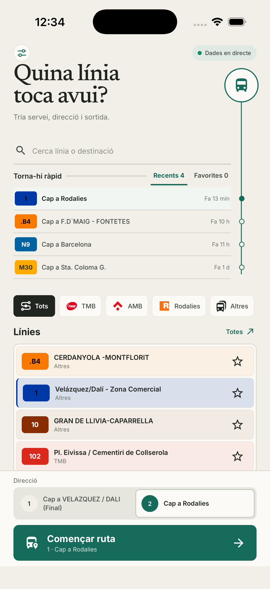
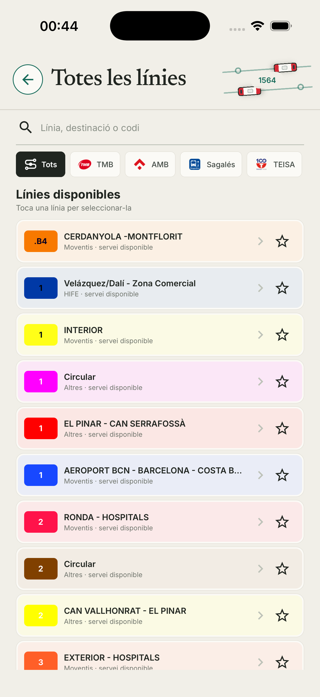
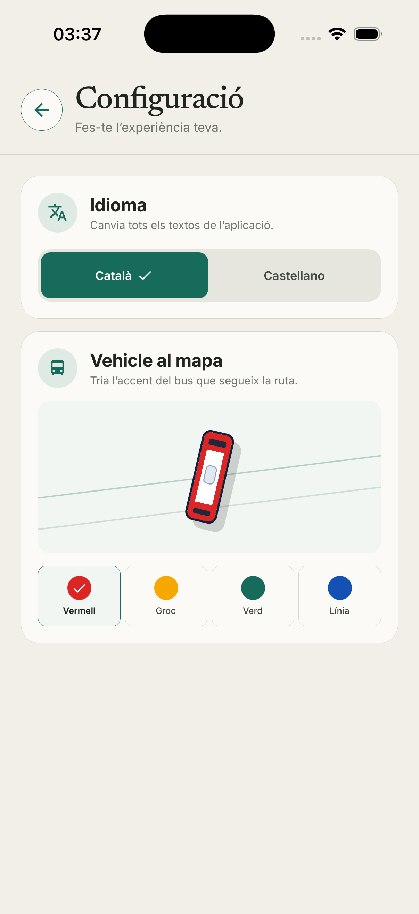
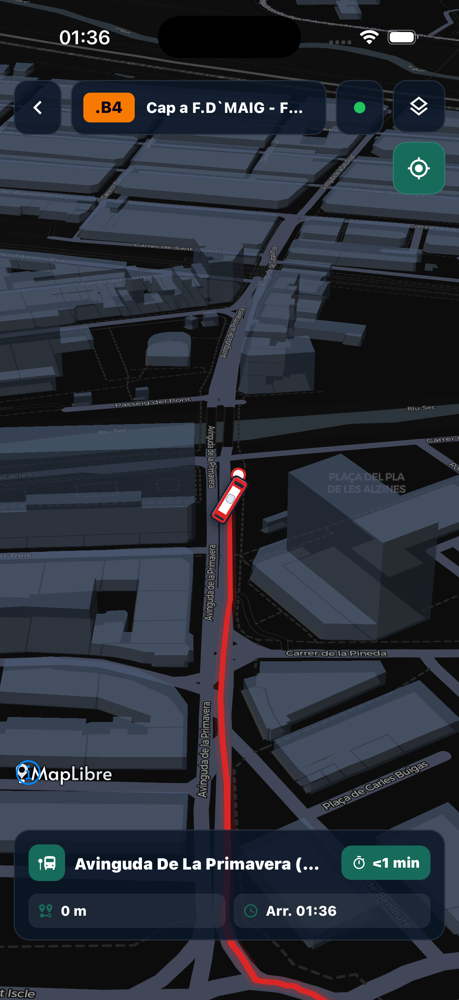

# AlVolant - BFF and APP

Aplicació mòbil per preparar i seguir serveis d’autobús sobre la xarxa integrada de transport. El repositori inclou una app Expo/React Native orientada a iPhone i un Backend-for-Frontend FastAPI que agrega GTFS estàtic, GTFS-Realtime i informació de trànsit.

<p align="center">
  
  &nbsp;
  
  &nbsp;
  
  &nbsp;
  
</p>

## Què permet fer

- Cercar i filtrar 1.000+ serveis per operador, codi o destinació.
- Entrar amb una animació de sincronització i passar a un mode de cerca dedicat.
- Consultar un catàleg complet de línies en una pantalla independent.
- Guardar favorites en una llista scrollable i fins a quatre rutes recents localment, sense compte d’usuari.
- Prioritzar les línies amb parades més properes quan hi ha permís d’ubicació.
- Canviar tota la interfície entre català i castellà.
- Personalitzar el vehicle del mapa amb quatre accents validats.
- Seleccionar sentit, sortida programada i vehicle abans d’iniciar el servei.
- Navegar sobre un mapa fosc amb ruta, parades, edificis 3D i trànsit; el vehicle s’ajusta a la línia quan el GPS és coherent i mostra la posició real durant desviaments.
- Treballar en retrat i horitzontal respectant les safe areas de l’iPhone.

Les preferències es desen amb AsyncStorage, estan versionades, validades i limitades de mida. No s’hi desa cap dada sensible ni credencial d’usuari. La ubicació no forma part de les preferències ni de la telemetria: per ordenar línies properes, l’app l’arrodoneix abans d’enviar-la al BFF; per consultar el trànsit viatja dins el cos d’un `POST` i el BFF l’arrodoneix abans de consultar el proveïdor. Les coordenades exactes no es registren ni es persisteixen. Consulta la [política de privacitat](docs/PRIVACY.md) per veure els fluxos i la retenció.

## Arquitectura

```text
ATM GTFS / GTFS-RT          TomTom Traffic
          \                    /
           \                  /
            v                v
         FastAPI BFF  <-->  Redis
              |
              | HTTPS/WSS
              | X-API-Key temporal, no autenticació forta
              | WebSocket /api/v1/ws/live
              v
       Expo / React Native
       iPhone portrait + landscape
```

### App mòbil

- Expo SDK 57 i React Native 0.86.
- React Navigation amb pantalles d’inici, catàleg, configuració i mapa.
- MapLibre Native amb CARTO i Esri World Imagery.
- Cache local acotada per a favorites i recents.
- Peticions amb timeout, validació d’identificadors i HTTPS obligatori fora de desenvolupament.
- Invalidacions GTFS-Realtime per WebSocket amb reconnexió acotada, refresc coalescent i conservació de l’última dada vàlida.
- Telemetria pròpia acotada, sense ubicació, identificadors de línia, missatges d’error ni traces.

### BFF

- FastAPI amb respostes ORJSON.
- Redis per a geometries, metadades i dades en temps real.
- Control d’accés HTTP i WebSocket amb `X-API-Key` per al desenvolupament.
- Rate limiting per connexió directa, límits de cos i WebSocket i validació estricta de payloads.
- Hosts i destinacions sortints permesos explícitament en producció.
- Càrrega i renovació GTFS fora de l’event loop, amb descàrregues i ZIPs acotats.
- Snapshot GTFS generacional: catàleg, trips i calendari només passen a `ready` junts.
- GTFS-Realtime parcial i acotat per bytes, entitats i camps repetits; un feed corrupte no invalida els altres.
- Telemetria pròpia d’escriptura única, amb retenció curta i consulta administrativa directa a Redis.

## Estructura del repositori

```text
app-conductor/             App Expo / React Native
  src/screens/             Inici, catàleg, configuració i mapa
  src/services/            API, presentació i preferències locals
app/                       BFF FastAPI
  api/v1/                  GTFS, GTFS-RT, trànsit i WebSocket
  services/                Ingesta, normalització i cache
tests/                     Proves del backend
docs/screenshots/          Captures reals de l’iPhone Simulator
docs/design/               Handoff vectorial del vehicle
docs/PRIVACY.md            Política i inventari de dades
```

## Model del vehicle

El marcador del bus és programàtic i no depèn d’una malla 3D. El handoff de disseny inclou les vistes superior, lateral, frontal i posterior, les proporcions i les quatre variants d’accent:

- [SVG editable](docs/design/bus-vehicle-model.svg)
- [Previsualització PNG](docs/design/bus-vehicle-model.png)

## Requisits

- Python 3.12 o superior.
- Node.js i npm.
- Redis local o Docker.
- Xcode amb un iPhone Simulator per executar iOS.

## Configuració

Parteix dels exemples versionats i no reutilitzis cap secret entre serveis:

```bash
cp .env.example .env
cp app-conductor/.env.example app-conductor/.env.local
```

El BFF necessita una clau de desenvolupament i Redis local:

```ini
BFF_API_KEY=replace-with-at-least-32-random-characters
REDIS_URL=redis://localhost:6379/0
```

Configura la mateixa clau de desenvolupament a `app-conductor/.env.local`.

`EXPO_PUBLIC_BFF_API_KEY` queda inclosa al bundle i no s’ha de considerar un secret ni una autenticació forta. Serveix per separar el desenvolupament casual del BFF, però una persona pot extreure-la d’una build. La distribució de producció queda condicionada a registrar l’App ID i el bundle identifier definitius, validar App Attest al servidor i intercanviar l’atestació per credencials de curta durada. També cal usar HTTPS/WSS; no s’ha d’exposar directament Uvicorn a Internet.

### Perfil Docker endurit

Per aixecar l’stack contenidoritzat, defineix a `.env` valors diferents i d’alta entropia per a `BFF_API_KEY`, `RATE_LIMIT_HASH_KEY` i `REDIS_PASSWORD`, i afegeix la clau de TomTom:

```ini
ENVIRONMENT=production
DOCS_ENABLED=false
TRUSTED_HOSTS=bff.example.cat
CORS_ALLOWED_ORIGINS=
BFF_API_KEY=replace-with-a-unique-random-value
RATE_LIMIT_HASH_KEY=replace-with-a-different-random-value
REDIS_PASSWORD=replace_with_another_random_value_2026
TOMTOM_API_KEY=replace-with-the-provider-key
FORWARDED_ALLOW_IPS=127.0.0.1
```

Després:

```bash
docker compose up --build
```

Compose no publica Redis al host: només el BFF hi pot accedir per la xarxa interna, amb una contrasenya URL-safe de 32–512 caràcters i una ACL que no permet `KEYS`, administració ni claus fora dels namespaces de l’app. El perfil reserva per defecte 3 GiB al BFF i 1,5 GiB al contenidor Redis (`maxmemory=1gb`): el benchmark del feed oficial del 12 de juliol de 2026 va arribar a 2,27 GiB de RSS durant el parse i a 533 MiB de Redis durant un rollover de dues generacions.

El BFF s’executa sense privilegis, amb el sistema de fitxers de només lectura, límits de recursos i comprovació de liveness. `TRUSTED_HOSTS` ha de contenir només els hosts preservats pel reverse proxy. `FORWARDED_ALLOW_IPS` ha de contenir exclusivament la IP o CIDR del proxy que elimina qualsevol `X-Forwarded-*` entrant abans de crear-ne un de nou; no utilitzis `*`. El comodí, Swagger i Redis sense autenticació fan fallar l’arrencada en producció.

## Execució local

Instal·la el backend i inicia Redis:

```bash
python3 -m venv .venv
source .venv/bin/activate
pip install -e ".[dev]"
redis-server
```

En un altre terminal, inicia el BFF:

```bash
.venv/bin/uvicorn app.main:app --host 127.0.0.1 --port 8000
```

Per fer una prova temporal des d’un iPhone fora de casa, segueix el perfil de [proxy HTTPS i port forwarding](docs/REMOTE_TESTING.md). No publiquis directament els ports del BFF, Redis o Metro.

Instal·la i executa l’app:

```bash
./install-ios.sh
```

Aquesta ordre genera el projecte natiu, valida TypeScript, compila una build
`Release` autònoma i la instal·la al primer iPhone Simulator arrencat. No tria
mai un iPad. Pots fixar el dispositiu amb `IOS_SIMULATOR_UDID=<udid>`.

### IPA unsigned d’una sola ordre

En un Mac amb Xcode i CocoaPods, el script reprodueix el prebuild, valida
TypeScript, compila per a iPhone físic sense signatura i comprova el ZIP final:

```bash
./install-ios.sh --ipa
```

L’artefacte queda a `app-conductor/build/AlVolant-unsigned-<versió>-<revisió>.ipa`
i el log a `app-conductor/build/unsigned-ipa-build.log`. Calen com a mínim 3 GiB
lliures. L’IPA inclou l’extensió de Live Activities, però no es pot instal·lar en
un iPhone fins que se signi l’app i l’extensió amb un certificat i perfils de
provisioning compatibles.

## API principal

Tots els endpoints de dades requereixen `X-API-Key`.

- `GET /api/v1/gtfs/routes`
- `POST /api/v1/gtfs/routes/nearby`
- `GET /api/v1/gtfs/shapes/{route_id}`
- `GET /api/v1/gtfs/stops/{route_id}`
- `GET /api/v1/gtfs/routes/{route_id}/upcoming-trips`
- `GET /api/v1/atm_rt/vehicles/{route_id}`
- `GET /api/v1/atm_rt/trips/{route_id}`
- `POST /api/v1/traffic/summary`
- `POST /api/v1/telemetry/events`
- `WS /api/v1/ws/live`

Swagger UI està disponible a `http://localhost:8000/docs` només quan `DOCS_ENABLED=true`, pensat per a desenvolupament.

## Diagnòstics i telemetria

La telemetria és pròpia, d’escriptura única i orientada a detectar regressions: compta pantalles, fases d’ús, errors JavaScript per tipus i rendiment de peticions. No accepta coordenades, identificadors de ruta o vehicle, URL completes, cossos de petició, capçaleres, missatges d’error ni traces. La sessió és efímera i el BFF només en desa un hash curt; no hi ha compte ni identificador persistent.

Redis conserva els esdeveniments durant tres dies per defecte, amb quotes diàries, llistes acotades i redacció addicional al servidor. No existeix cap endpoint HTTP de lectura. En un entorn local amb accés explícit a Redis, genera l’informe així:

```bash
.venv/bin/python scripts/telemetry_report.py --days 3 --errors 50
```

Aquest informe és per a manteniment local i no s’ha de servir des d’una ruta pública. Els errors natius fatals, MapLibre i els tancaments per memòria poden no arribar a la cua JavaScript; les builds de prova s’han de distribuir amb TestFlight i revisar també a Xcode Organizer.

## Model de seguretat i portes de producció

- El BFF rebutja configuracions de producció insegures: clau curta, `TRUSTED_HOSTS=*`, CORS comodí, documentació oberta o Redis sense autenticació/TLS.
- Les coordenades de trànsit viatgen al cos d’un `POST`, no a l’URL ni als access logs; el servei limita l’àrea i les arrodoneix abans del proveïdor i de la cache.
- Les consultes TomTom comparteixen cache i single-flight, tenen quotes globals a Redis i obren circuit temporal davant un `429` del proveïdor.
- Les descàrregues externes exigeixen HTTPS i hosts permesos, no segueixen redireccions fora de la llista i imposen límits de mida, nombre de fitxers i ràtio de compressió.
- Els cossos HTTP, llistes, caches, connexions i missatges WebSocket tenen límits explícits. Els logs redacten secrets, query strings, coordenades i directoris d’usuari.
- Les dependències Python de producció estan bloquejades amb hashes i els contenidors usen versions fixades.
- El rate limit s’aplica abans de llegir el cos; el desplegament públic també ha de posar davant un reverse proxy amb TLS, límits de connexions i timeout de capçaleres/cos lent.
- `/health` és una liveness barata; `/health/ready` està limitat i comprova també una escriptura efímera a Redis, de manera que `noeviction`/OOM no deixa el servei anunciat com a preparat.

Abans d’una distribució pública encara són obligatoris requisits externs que el repositori no pot completar sol: substituir la clau estàtica del client per [App Attest](https://developer.apple.com/documentation/devicecheck/validating-apps-that-connect-to-your-server), amb reptes d’un sol ús i credencials curtes; validar una build signada a [TestFlight](https://developer.apple.com/testflight/) (fallades natives, dSYM, manifest/informe de privacitat i declaracions d’App Store Connect); i construir/executar l’stack amb un daemon Docker real, escanejar la imatge/SBOM i provar el reverse proxy de producció. Sense aquestes portes, el sistema és adequat per a desenvolupament i proves controlades, no per considerar-lo autenticat fortament a Internet.

## Verificació

```bash
cd app-conductor && npx tsc --noEmit
cd .. && .venv/bin/python -m pytest -q
git diff --check
```

## Funcionament del servidor BFF

```text
ATM GTFS / GTFS-RT ----HTTPS acotat----+
                                         v
TomTom Traffic --------HTTPS acotat--> FastAPI BFF <--> Redis privat
                                         ^   |
                                         |   +-- workers GTFS-RT i renovació GTFS
                                         |   +-- REST /api/v1/{gtfs,atm_rt,traffic}
                                         |   +-- POST /api/v1/telemetry/events
                                         |   +-- WS /api/v1/ws/live
                                         |
                                  HTTPS/WSS + controls
                                         |
                                  App Expo per a iPhone
```
