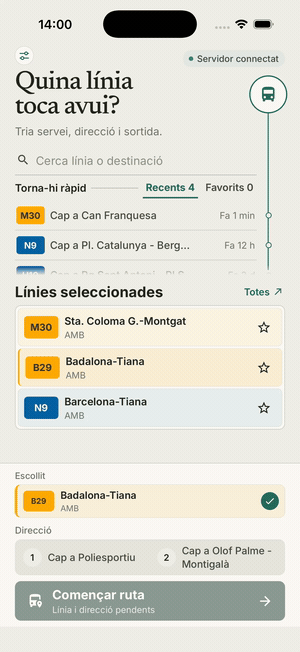
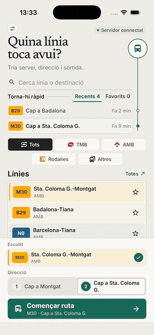
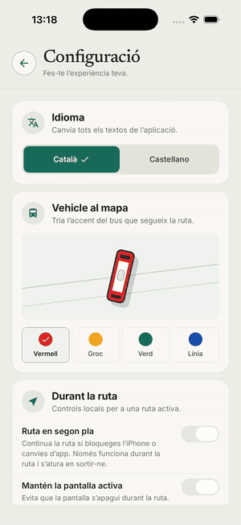

[English](README.md) · [Català](README_cat.md)

<h1>
  
  AlVolant — mobile app and BFF
</h1>

https://github.com/user-attachments/assets/bf468c74-a006-4d03-99c4-83f689ed26f9

<strong>AlVolant presentation video.</strong>

AlVolant is an iPhone app for preparing and following bus services in the integrated transport network of Catalonia. The repository includes an Expo/React Native app and a FastAPI Backend-for-Frontend (BFF). The BFF combines static GTFS, GTFS-Realtime, traffic data, and Redis cache data.

## Screenshots

<table>
  <tr>
    <td width="25%" align="center">
      
       
      <strong>1. Prepare a service</strong> Select a line, direction, and departure.
    </td>
    <td width="25%" align="center">
      
       
      <strong>2. Browse lines</strong> Search and filter the complete catalogue.
    </td>
    <td width="25%" align="center">
      
       
      <strong>3. Make it yours</strong> Choose language, operators, and vehicle style.
    </td>
    <td width="25%" align="center">
      
       
      <strong>4. Follow the route</strong> Track the service on a live 3D map.
    </td>
  </tr>
</table>

## Built with Codex and GPT-5.6

AlVolant was built during OpenAI Build Week with Codex and GPT-5.6.

- Codex helped implement and refine the Expo app, FastAPI BFF, iOS build tools, tests, security checks, and documentation.
- GPT-5.6 helped iterate on the product flow, responsive UI, map behavior, route simulation, and technical design.
- The developer made the product choices, reviewed the changes, tested the iPhone build, and kept the final code in this repository.

## Quick start for judges

Use macOS with Docker Desktop, Node.js and npm, Xcode, CocoaPods, and at least one iPhone Simulator runtime. Do not use an iPad runtime.

~~~bash
./run-local.sh
~~~

The script does the following:

1. Creates .env and app-conductor/.env.local only when they do not exist.
2. Uses random local development keys. It does not print them.
3. Asks before the first local basemap bootstrap. If approved, it downloads public OpenStreetMap and Planetiler data, builds a Catalunya PMTiles archive, and caches it in ignored `.alvolant/maps/`.
4. Starts Redis, the BFF, Martin, and a loopback-only map gateway with Docker Compose.
5. Waits for the local map, `/health/ready`, and the GTFS catalogue. The first map and GTFS downloads can take several minutes.
6. Opens Simulator, builds a Release app, and installs it on an iPhone Simulator only.

If an existing .env does not contain the values Docker needs, the script keeps it unchanged and creates an ignored .env.run-local profile.
For the Simulator build, it injects the matching local BFF URL and key into the build process. It does not change an existing app-conductor/.env.local file.

The normal light and dark maps do not use `alvolant.duckdns.org`, any other personal server, or a hosted tile API. The first bootstrap needs Internet access, at least 8 GiB free disk space, and at least 4 GiB assigned to Docker Desktop (6 GiB is recommended for the complete stack). Later runs use the cached local PMTiles archive, including when the public map host is unavailable. Enter `Y` at the prompt, or use `ALVOLANT_BOOTSTRAP_MAPS=1 ./run-local.sh` for a non-interactive first run.

The runner is deliberately for the iPhone Simulator. It uses loopback-only `http://localhost:3002` and permits clear-text HTTP only to explicit loopback BFF addresses for this local build. This is correct for Simulator but not for a physical iPhone, where `localhost` means the phone itself. A physical-device build needs an HTTPS map origin and BFF origin that you operate or another supported deployment path.

The local stack is tested on Apple Silicon and Intel Macs. The pinned Martin, Planetiler, and nginx images publish both `arm64` and `amd64` variants, so Docker does not need CPU emulation on either Mac type. `./run-local.sh` checks the macOS/iPhone prerequisites before it starts the large first map download. On another operating system, `./run-local.sh --no-ios` can start the services when Docker is available, but the iPhone build is macOS-only.

Use this command to start the complete local stack without building iOS:

~~~bash
./run-local.sh --no-ios
~~~

Stop the local services with:

~~~bash
./run-local.sh --down
~~~

The Release build includes its JavaScript bundle. Metro is not required for this path. Use Metro only when you change JavaScript during development.

## Product flows

<table>
  <tr>
    <td width="33%" align="center">
      
       
      <strong>1. Search a line</strong> Find a service by line, destination, or operator.
    </td>
    <td width="33%" align="center">
      
       
      <strong>2. Start a service</strong> Select a direction and begin the route.
    </td>
    <td width="33%" align="center">
      
       
      <strong>3. Reach the stop</strong> Follow the service as it approaches the stop.
    </td>
  </tr>
  <tr>
    <td colspan="2" align="center">
      
       
      <strong>4. Follow M30 in landscape</strong> Use the responsive live-map view during the service.
    </td>
    <td width="33%" align="center">
      
       
      <strong>5. Set preferences</strong> Personalise language, operators, and vehicle appearance.
    </td>
  </tr>
</table>

## Main functions

- Search and filter more than 1,000 services by operator, code, or destination.
- Show an animated data sync screen, then switch to a focused search mode.
- Open the full catalogue on a separate screen.
- Store favourite routes and up to four recent routes locally. No account is required.
- Sort lines by nearby stops when location permission is available.
- Switch the whole UI between Catalan and Spanish.
- Select one of four vehicle accent colours.
- Select direction, scheduled departure, and vehicle before starting a service.
- Follow a dark map with route, stops, 3D buildings, traffic, and a bus marker. The marker follows the route only when GPS is consistent. It shows the real position during a diversion.
- Work in portrait and landscape while respecting iPhone safe areas.

Preferences use AsyncStorage. They are versioned, validated, and size-limited. They do not store user credentials or sensitive data. The app does not save precise location in preferences or telemetry. It rounds nearby-line coordinates before it sends them to the BFF. Traffic coordinates use a POST body and are rounded by the BFF before a provider request. The system does not store or log exact coordinates.

## Architecture

~~~text
ATM GTFS / GTFS-RT          TomTom Traffic
          \                    /
           \                  /
            v                v
         FastAPI BFF  <-->  Redis
              |
              | HTTPS/WSS
              | Temporary X-API-Key, not strong authentication
              | WebSocket /api/v1/ws/live
              v
       Expo / React Native
       iPhone portrait + landscape
~~~

### Mobile app

- Expo SDK 57 and React Native 0.86.
- React Navigation screens for home, catalogue, settings, and map.
- MapLibre Native with CARTO and Esri World Imagery.
- Bounded local cache for favourites and recents.
- Requests with timeouts, identifier validation, and HTTPS outside development.
- GTFS-Realtime invalidation through WebSocket. Reconnects are bounded, refreshes are coalesced, and the app keeps the last valid data.
- Bounded first-party telemetry. It stores no location, route ID, error message, or stack trace.

### BFF

- FastAPI with ORJSON responses.
- Redis for shapes, metadata, and live data.
- HTTP and WebSocket access control with X-API-Key during development.
- Per-connection rate limits, body and WebSocket limits, and strict payload validation.
- Explicit trusted hosts and outbound destinations in production.
- GTFS download and renewal outside the event loop. Downloads and ZIP files have limits.
- Generational GTFS snapshots. Catalogue, trips, and calendar become ready together.
- Bounded partial GTFS-Realtime parsing. A bad feed does not invalidate other feeds.
- Write-only, short-retention telemetry in Redis. Local administrators can query it directly.

## Repository layout

~~~text
app-conductor/             Expo / React Native app
  src/screens/             Home, catalogue, settings, and map
  src/services/            API, presentation, and local preferences
app/                       FastAPI BFF
  api/v1/                  GTFS, GTFS-RT, traffic, and WebSocket routes
  services/                Ingestion, normalisation, and cache
tests/                     BFF tests
docs/screenshots/          Real iPhone Simulator screenshots
docs/videos/               Presentation video and product examples
docs/design/               Vehicle design handoff
maps/                      Versioned style templates, fonts, and local map server config
~~~

## Vehicle model

The bus marker is generated in code. It does not use a 3D mesh. The design handoff includes top, side, front, and back views, proportions, and the four accent variants.

- [Editable SVG](docs/design/bus-vehicle-model.svg)
- [PNG preview](docs/design/bus-vehicle-model.png)

## Requirements

- macOS for the iPhone build.
- Xcode and an iPhone Simulator runtime.
- Docker Desktop.
- At least 8 GiB free disk space for the one-time local vector-map bootstrap.
- At least 4 GiB assigned to Docker Desktop; 6 GiB is recommended for the full local stack.
- Node.js and npm.
- CocoaPods.
- Python 3.12 or later for native BFF development and tests.

## Configuration

The quickest local setup is ./run-local.sh. It creates random values when the local files are absent. It keeps an existing .env unchanged and uses .env.run-local only when the existing file cannot start Docker.

`run-local.sh` also starts the local MapLibre stack. `maps/` contains the style templates, font files, and server configuration; only generated OSM input and PMTiles output live under ignored `.alvolant/maps/`. The runner asks before the first download and never uses a developer-owned DNS name. Set `EXPO_PUBLIC_MAP_ORIGIN=http://localhost:3002` for a manual iPhone Simulator build, or an HTTPS origin for a deployed build.

You can also copy the tracked examples:

~~~bash
cp .env.example .env
cp app-conductor/.env.example app-conductor/.env.local
~~~

The two files work together as a loopback-only local profile. They contain the same public development BFF key. This key is part of the Expo bundle. It is not a production secret and is not strong authentication.

Do not deploy the example values. They include a marker that production validation rejects. For a public deployment, use new high-entropy values for BFF_API_KEY, RATE_LIMIT_HASH_KEY, and REDIS_PASSWORD. Use HTTPS and WSS. Do not expose Uvicorn, Redis, or Metro directly to the Internet.

TomTom, ArcGIS, and TMB credentials are optional for the local demo. When they are empty, only the feature that needs the provider is unavailable. The BFF and the route catalogue still start. Docker Compose mounts a non-empty optional provider key as a runtime secret.

### Hardened Docker profile

For a production-like Docker profile, set separate high-entropy values in .env:

~~~ini
ENVIRONMENT=production
DOCS_ENABLED=false
TRUSTED_HOSTS=bff.example.cat
CORS_ALLOWED_ORIGINS=
BFF_API_KEY=replace-with-a-unique-random-value
RATE_LIMIT_HASH_KEY=replace-with-a-different-random-value
REDIS_PASSWORD=replace_with_another_random_value_2026
TOMTOM_API_KEY=replace-with-the-provider-key
FORWARDED_ALLOW_IPS=127.0.0.1
~~~

Then run:

~~~bash
docker compose up --build
~~~

Compose does not publish Redis. Only the BFF can reach it on the internal network. Redis uses a 32–512 character URL-safe password and an ACL. The ACL blocks KEYS, administrative commands, and keys outside the app namespaces. The default profile reserves 3 GiB for the BFF and 1.5 GiB for Redis. The Redis maxmemory value is 1 GiB.

The BFF runs without privileges, uses a read-only filesystem, resource limits, and a liveness check. In production, TRUSTED_HOSTS must list only the hosts kept by the reverse proxy. FORWARDED_ALLOW_IPS must list only the proxy IP or CIDR that removes and recreates forwarded headers. Do not use a wildcard. Open Swagger and unauthenticated Redis make the production process fail at startup.

## Local development

To run the BFF without Docker, install Redis and the backend dependencies:

~~~bash
python3 -m venv .venv
source .venv/bin/activate
pip install -e ".[dev]"
redis-server
~~~

Start the BFF in another terminal:

~~~bash
.venv/bin/uvicorn app.main:app --host 127.0.0.1 --port 8000
~~~

For the iPhone Simulator:

~~~bash
./install-ios.sh
~~~

This command creates the native project, validates TypeScript, builds a standalone Release app, and installs it on the first booted iPhone Simulator. It never selects an iPad. Set IOS_SIMULATOR_UDID to choose a specific iPhone.

### One-command unsigned IPA

On macOS with Xcode and CocoaPods:

~~~bash
./install-ios.sh --ipa
~~~

The artifact is stored in app-conductor/build/AlVolant-unsigned-version-revision.ipa. The build log is stored in app-conductor/build/unsigned-ipa-build.log. The process needs at least 3 GiB of free disk space.

The IPA includes the Live Activities extension. You cannot install it on an iPhone until you sign the app and extension with compatible certificates and provisioning profiles.

## Main API

All data endpoints require X-API-Key.

- GET /api/v1/gtfs/routes
- POST /api/v1/gtfs/routes/nearby
- GET /api/v1/gtfs/shapes/{route_id}
- GET /api/v1/gtfs/stops/{route_id}
- GET /api/v1/gtfs/routes/{route_id}/upcoming-trips
- GET /api/v1/atm_rt/vehicles/{route_id}
- GET /api/v1/atm_rt/trips/{route_id}
- POST /api/v1/traffic/summary
- POST /api/v1/telemetry/events
- WS /api/v1/ws/live

Swagger UI is available at http://localhost:8000/docs only when DOCS_ENABLED=true. It is for development.

## Diagnostics and telemetry

The telemetry is first-party, write-only, and designed to find regressions. It counts screens, app phases, JavaScript error types, and request performance. It does not accept coordinates, route IDs, vehicle IDs, complete URLs, request bodies, headers, error messages, or stack traces.

The session is temporary. The BFF stores only a short hash. It has no account and no persistent person identifier. Redis retains events for three days by default. It also applies daily limits, bounded lists, and server-side redaction. There is no HTTP read endpoint.

With explicit local Redis access, generate a report with:

~~~bash
.venv/bin/python scripts/telemetry_report.py --days 3 --errors 50
~~~

This report is for local maintenance. Do not publish it through a public route. Fatal native errors, MapLibre failures, and out-of-memory exits can miss the JavaScript queue. TestFlight builds should also be checked in Xcode Organizer.

## Security model and production gates

- Production rejects insecure configuration: short keys, TRUSTED_HOSTS=*, wildcard CORS, open documentation, or Redis without authentication and TLS where TLS is needed.
- Traffic coordinates use a POST body, not a URL or access log. The service limits and rounds the area before provider and cache use.
- TomTom requests share cache and single-flight work. They use Redis global quotas and open a temporary circuit after a provider 429 response.
- External downloads require HTTPS and allowed hosts. Redirects cannot leave the allow-list. Files, ZIP entries, and compression ratios have limits.
- HTTP bodies, lists, caches, connections, and WebSocket messages have explicit limits. Logs redact secrets, query strings, coordinates, and user directories.
- Production Python dependencies use hashes. Container images use pinned versions.
- Rate limiting happens before the body is read. A public deployment still needs a TLS reverse proxy with connection limits and slow-header and body timeouts.
- /health is a cheap liveness endpoint. /health/ready is rate-limited and checks Redis writes and the complete GTFS cache.

Before public distribution, complete these external gates:

1. Replace the static client key with [App Attest](https://developer.apple.com/documentation/devicecheck/validating-apps-that-connect-to-your-server), one-time challenges, and short-lived credentials.
2. Validate a signed build in [TestFlight](https://developer.apple.com/testflight/). Check native failures, dSYMs, privacy manifest, and App Store Connect declarations.
3. Build the stack with a real Docker daemon. Scan the image and SBOM. Test the production reverse proxy.

Without these gates, AlVolant is suitable for development and controlled tests. It is not strong-authenticated public Internet software.

## Verification

~~~bash
cd app-conductor && npx tsc --noEmit
cd .. && .venv/bin/python -m pytest -q
git diff --check
~~~

## BFF flow

~~~text
ATM GTFS / GTFS-RT ----bounded HTTPS----+
                                         v
TomTom Traffic --------bounded HTTPS--> FastAPI BFF <--> Private Redis
                                         ^   |
                                         |   +-- GTFS-RT workers and GTFS refresh
                                         |   +-- REST /api/v1/{gtfs,atm_rt,traffic}
                                         |   +-- POST /api/v1/telemetry/events
                                         |   +-- WS /api/v1/ws/live
                                         |
                                  HTTPS/WSS + controls
                                         |
                                  Expo app for iPhone
~~~
